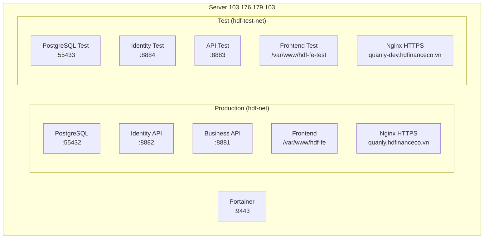

# Setup môi trường Test trên Portainer

> **Trạng thái:** ✅ Hoàn tất
> **Ngày:** 04/05/2026

## Kiến trúc đã triển khai

## Bảng so sánh môi trường

| Component | 🟢 Production | 🟡 Test |
|---|---|---|
| **Frontend** | `https://quanly.hdfinanceco.vn` | `https://quanly-dev.hdfinanceco.vn` |
| **FE Path** | `/var/www/hdf-fe` | `/var/www/hdf-fe-test` |
| **Identity API** | port `8882` | port `8884` |
| **Business API** | port `8881` | port `8883` |
| **PostgreSQL** | port `55432` | port `55433` |
| **Docker Network** | `hdf-net` | `hdf-test-net` |
| **Portainer Stack** | riêng từng service | `hdf-test` (Stack ID: 5) |
| **DB Data** | Production data | Clone từ prod (46 MB dump) |
| **Logging** | Warning | Debug |

## Thông tin kết nối Test

| Thông tin | Giá trị |
|---|---|
| **Frontend** | `https://quanly-dev.hdfinanceco.vn` |
| **Identity API** | `https://quanly-dev.hdfinanceco.vn/api/auth` |
| **Business API** | `https://quanly-dev.hdfinanceco.vn/api` |
| **DB Host** | `103.176.179.103` |
| **DB Port** | `55433` |
| **DB Name** | `crediflow` |
| **DB User** | `dev` |
| **DB Password** | `P&k24DLm!y3^5*4i` |

## Files đã tạo

| File | Mô tả |
|---|---|
| [docker-compose.yml](file:///d:/SourceCode/hdf/hdf-test-stack/docker-compose.yml) | Stack compose cho toàn bộ backend test |
| [docker-compose.yml](file:///d:/SourceCode/hdf/hdf-postgres/docker-compose.yml) | Config PostgreSQL production (lấy từ server) |
| [docker-compose.dev.yml](file:///d:/SourceCode/hdf/hdf-postgres/docker-compose.dev.yml) | Config PostgreSQL cho dev local |
| [postgresql.conf](file:///d:/SourceCode/hdf/hdf-postgres/config/postgresql.conf) | Config PG production |
| [postgresql-dev.conf](file:///d:/SourceCode/hdf/hdf-postgres/config/postgresql-dev.conf) | Config PG nhẹ cho dev |
| [01-schema-and-data.sql](file:///d:/SourceCode/hdf/hdf-postgres/init/01-schema-and-data.sql) | Full dump DB production (47.5 MB) |

## Server Nginx config test

Đã thêm file `/etc/nginx/sites-available/hdf-test` trên server, reverse proxy tới:
- `/api/auth/` → `127.0.0.1:8884` (Identity Test)
- `/api/` → `127.0.0.1:8883` (API Test)
- `/` → static files `/var/www/hdf-fe-test`

## TODO

- [ ] Build lại FE khi có thay đổi code và deploy riêng cho test (`/var/www/hdf-fe-test`)
- [ ] Build Docker image mới cho `hdf-api` và `hdf-identity` khi có code changes
