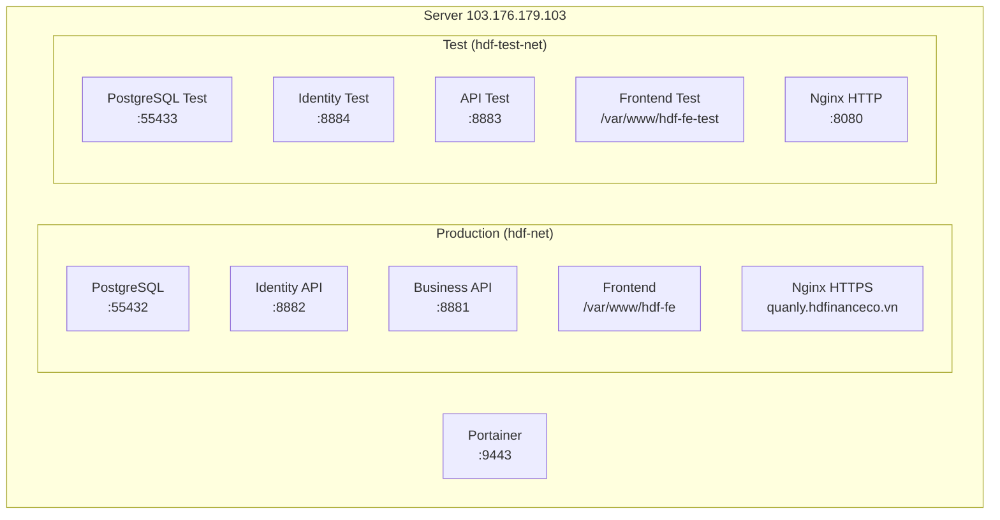

# 📋 Báo cáo công việc — Ngày 04/05/2026

## Tổng quan

Phiên làm việc bao gồm 5 phần chính: fix bug frontend/backend, phân tích lỗi login, thiết lập hạ tầng, và setup môi trường test.

---

## 1. Fix Bug: Tổng cộng footer table tăng khi hủy hợp đồng

> **Trạng thái:** ✅ Đã fix

### Hiện tượng
Khi hủy hợp đồng trong `loans.component.html` và load lại trang, giá trị tổng cộng ở footer bảng bị tăng bất thường.

### Nguyên nhân & Fix

| # | Nguyên nhân | File | Fix |
|---|---|---|---|
| 1 | **Phân trang không ổn định (non-deterministic)** — `OrderBy` thiếu tie-breaker, gây trùng lặp dữ liệu giữa các trang | [LoanContractService.cs](file:///d:/SourceCode/hdf/hdf-api/CrediFlow.API/Services/LoanContractService.cs) | Bổ sung `.ThenByDescending(c => c.CreatedAt)` vào tất cả sort cases |
| 2 | **Rủi ro cộng chuỗi thay vì cộng số** — `reduce()` có thể nối string nếu API trả giá trị dạng chuỗi | [loans.component.ts](file:///d:/SourceCode/hdf/hdf-fe/src/app/pages/loans/loans.component.ts) | Bọc `Number()` cho `principalAmount`, `insuranceAmountSnapshot`, `fileFeeAmountSnapshot`, `netDisbursedAmount` |

---

## 2. Fix Bug: Chuyển phụ trách hợp đồng không auto đổi chi nhánh

> **Trạng thái:** ✅ Đã fix

### Hiện tượng
Khi chuyển phụ trách hợp đồng sang nhân viên khác, hợp đồng không tự động cập nhật `StoreId` theo chi nhánh của nhân viên mới.

### Fix

**File:** [LoanContractService.cs](file:///d:/SourceCode/hdf/hdf-api/CrediFlow.API/Services/LoanContractService.cs) — method `AssignLoanContract`

```diff
+ var targetUser = await DbContext.AppUsers.FindAsync(targetUserId)
+                  ?? throw new KeyNotFoundException($"Không tìm thấy nhân viên với Id = {targetUserId}");
+
+ if (targetUser.StoreId.HasValue)
+ {
+     obj.StoreId = targetUser.StoreId.Value;
+ }
+
  obj.AssignedToUserId = targetUserId;
  obj.UpdatedAt = DateTime.Now;
```

---

## 3. Phân tích lỗi: API Login lúc được lúc không

> **Trạng thái:** 📝 Đã phân tích, đề xuất fix (chưa apply code)

### Phát hiện 3 vấn đề

| # | Vấn đề | Mức độ | File |
|---|---|---|---|
| 1 | **Race condition trong `SaveChangesAsync`** — khối `catch` flush dirty entities, có thể corrupt `FailedLoginAttempts` | 🔴 Cao | [AuthService.cs](file:///d:/SourceCode/hdf/hdf-identity/CrediFlow.Identity/Services/AuthService.cs#L224-L233) |
| 2 | **ExceptionHandler không trả response body** — code response đã bị comment out, FE nhận response rỗng | 🟠 Trung bình | [Program.cs](file:///d:/SourceCode/hdf/hdf-identity/CrediFlow.Identity/Program.cs#L284-L316) |
| 3 | **ClockSkew mismatch** — Identity set `Zero`, API set `1 phút` | 🟡 Thấp | Program.cs của cả 2 service |

> Chi tiết: [login_bug_report.md](file:///C:/Users/truonghx/.gemini/antigravity/brain/fa6c625b-da14-4436-935c-4e984a359b9e/login_bug_report.md)

---

## 4. Điều tra login user `tungbeo`

> **Trạng thái:** ✅ Đã xác định nguyên nhân

### Kết quả truy vấn DB (production)

```
username | failed_login_attempts | locked_until | hash_prefix
tungbeo  |                     3 |              | $2a$11$9pKXRJmKkGFsA..Bm/i8Xul
```

### Login history gần nhất

```
2026-05-04 08:09:02 | FAIL | Invalid password
2026-05-04 08:08:11 | FAIL | Invalid password
2026-05-04 06:31:22 | OK   |
2026-05-02 15:23:44 | FAIL | Account is locked for 15 more minutes
2026-05-02 15:22:49 | FAIL | Too many failed attempts - account locked
```

### Kết luận
- Tài khoản chưa bị lock (`locked_until = NULL`)
- `failed_login_attempts = 3` (chưa đạt ngưỡng 5)
- **Password `abc@12345` không khớp với hash trong DB** → User đã đổi mật khẩu hoặc mật khẩu bị set sai
- Đã reset `failed_login_attempts` về 0

---

## 5. Setup môi trường Test trên Portainer

> **Trạng thái:** ✅ Hoàn tất

### Kiến trúc đã triển khai



### Bảng so sánh môi trường

| Component | 🟢 Production | 🟡 Test |
|---|---|---|
| **Frontend** | `https://quanly.hdfinanceco.vn` | `http://103.176.179.103:8080` |
| **FE Path** | `/var/www/hdf-fe` | `/var/www/hdf-fe-test` |
| **Identity API** | port `8882` | port `8884` |
| **Business API** | port `8881` | port `8883` |
| **PostgreSQL** | port `55432` | port `55433` |
| **Docker Network** | `hdf-net` | `hdf-test-net` |
| **Portainer Stack** | riêng từng service | `hdf-test` (Stack ID: 5) |
| **DB Data** | Production data | Clone từ prod (46 MB dump) |
| **Logging** | Warning | Debug |

### Thông tin kết nối Test

| Thông tin | Giá trị |
|---|---|
| **Frontend** | `http://103.176.179.103:8080` |
| **Identity API** | `http://103.176.179.103:8884` |
| **Business API** | `http://103.176.179.103:8883` |
| **DB Host** | `103.176.179.103` |
| **DB Port** | `55433` |
| **DB Name** | `crediflow` |
| **DB User** | `dev` |
| **DB Password** | `P&k24DLm!y3^5*4i` |

### Files đã tạo

| File | Mô tả |
|---|---|
| [docker-compose.yml](file:///d:/SourceCode/hdf/hdf-test-stack/docker-compose.yml) | Stack compose cho toàn bộ backend test |
| [docker-compose.yml](file:///d:/SourceCode/hdf/hdf-postgres/docker-compose.yml) | Config PostgreSQL production (lấy từ server) |
| [docker-compose.dev.yml](file:///d:/SourceCode/hdf/hdf-postgres/docker-compose.dev.yml) | Config PostgreSQL cho dev local |
| [postgresql.conf](file:///d:/SourceCode/hdf/hdf-postgres/config/postgresql.conf) | Config PG production |
| [postgresql-dev.conf](file:///d:/SourceCode/hdf/hdf-postgres/config/postgresql-dev.conf) | Config PG nhẹ cho dev |
| [01-schema-and-data.sql](file:///d:/SourceCode/hdf/hdf-postgres/init/01-schema-and-data.sql) | Full dump DB production (47.5 MB) |

### Server Nginx config test
Đã thêm file `/etc/nginx/sites-available/hdf-test` trên server, listen port `8080`, reverse proxy tới:
- `/api/auth/` → `127.0.0.1:8884` (Identity Test)
- `/api/` → `127.0.0.1:8883` (API Test)
- `/` → static files `/var/www/hdf-fe-test`

---

## Các việc còn lại (TODO)

- [ ] Apply fix cho lỗi login race condition trong `AuthService.cs`
- [ ] Apply fix cho `ExceptionHandler` không trả response body trong Identity `Program.cs`
- [ ] Reset hoặc đổi password cho user `tungbeo` trên production
- [ ] Build lại FE khi có thay đổi code và deploy riêng cho test (`/var/www/hdf-fe-test`)
- [ ] Build Docker image mới cho `hdf-api` và `hdf-identity` khi có code changes
